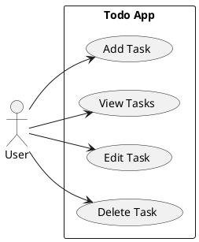
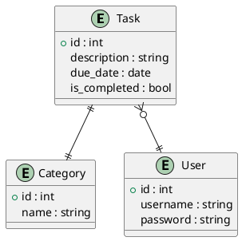
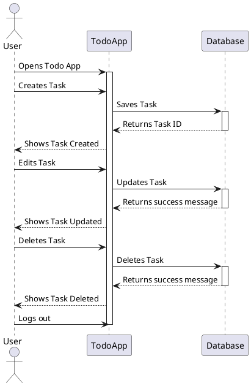
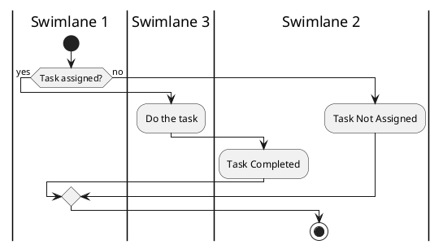
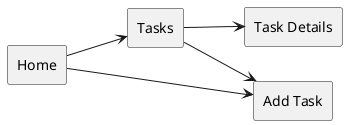
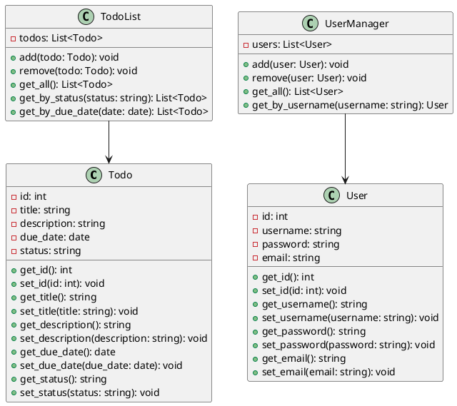
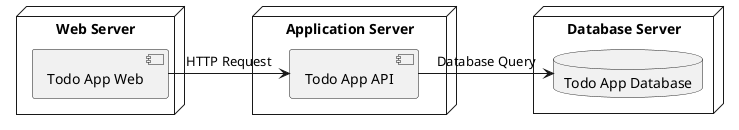

# System Documentation

## {{cookiecutter.project_name}}

### Prepared by:

{{ cookiecutter.author_name }} | <{{ cookiecutter.email }}>

### Compiled and Completed:

*date*

# Team

|**Role**|**Member**|**Responsibilities**|
| :- | :- | :- |
|Developer|{{ cookiecutter.author_name }} <{{ cookiecutter.email }}>|- Designed and developed {{ cookiecutter.project_name }} site |

# System Rationale
## Description 

## Objectives 

## Significance 

## Scope

# Business Analysis

## Use Case Diagram
A Use Case Diagram is a graphical representation of the interactions between a system and its users, known as actors. It is used to capture the functional requirements of a system and to model the user's interactions with that system.

A use case diagram consists of three main elements:

- Actors: Represent the users of the system, including external entities such as people, organizations, or other systems.

- Use Cases: Represent the functions or services provided by the system to its actors. Each use case is a sequence of actions that the system performs to achieve a specific goal for the actor.

- Relationships: Show the relationships between actors and use cases, including generalization (an actor can perform multiple use cases), include (one use case includes the functionality of another), and extend (a use case extends the functionality of another).

There are three main relationships in a use case diagram:

- Generalization: This relationship indicates that one actor can perform multiple use cases.
- Include: This relationship indicates that one use case includes the functionality of another use case.
- Extend: This relationship indicates that a use case extends the functionality of another use case.

These relationships help to organize and simplify the use cases by showing how they are related and dependent on each other. Understanding these relationships is important for identifying potential problems and for making design decisions.

Use case diagrams are useful for defining the scope of a system, understanding the requirements of the users, and for communication between stakeholders. They provide a high-level view of the system and are useful for identifying potential problems early in the development process.

Refer to [PlantUML Documentation](https://plantuml.com/use-case-diagram)

## Entity Relationship Diagram
An Entity Relationship Diagram (ERD) is a graphical representation of entities and their relationships to each other, used in database design. It provides a high-level view of the structure of a database, including entities and the relationships between them.

An ERD consists of three main components:

- Entities: Represent objects or concepts in the real world, such as customers, orders, or products.

- Attributes: Represent characteristics or properties of an entity, such as name, address, or date of birth.

- Relationships: Represent the relationships between entities, such as a customer placing an order or a product being part of an order. Relationships can be one-to-one, one-to-many, or many-to-many.

ERDs are used to define the structure of a database and to communicate the relationships between entities to stakeholders. They are an important tool in database design, helping to ensure that the database is properly structured to support the needs of the system. ERDs can also be used to identify potential data redundancies, improve data integrity, and simplify database maintenance.

Refer to [PlantUML Documentation](https://plantuml.com/ie-diagram)

## CRUD Matrix

A CRUD Matrix, also known as a Create-Read-Update-Delete (CRUD) Matrix, is a table used in software development to identify and document the operations that can be performed on data within a system. It provides a high-level view of the functionality of the system and helps to ensure that all necessary operations are accounted for in the design.

The matrix consists of four basic operations:

- Create (C): Refers to the ability to add new data to the system.
- Read (R): Refers to the ability to retrieve or view existing data in the system.
- Update (U): Refers to the ability to modify existing data in the system.
- Delete (D): Refers to the ability to remove data from the system.

Each row in the matrix represents a data item or an object, and each column represents a specific operation. The intersection of a row and a column represents the specific operation that can be performed on the data item.

The CRUD matrix is a useful tool in ensuring that all necessary operations are accounted for in the design of the system and in identifying potential issues early in the development process.

|Modules|*object*|CDC|DRC|User|
|---|---|---|---|---|

**Legends:**
* Upper case notation refers to global CRUD
* Lower case notation refers to object-level CRUD

## Sequence Diagram
A Sequence Diagram represents the interactions between objects or components in a system. It shows the sequences of messages exchanged between objects over time, and provides a visual representation of the interactions between objects and the order in which these interactions occur.

A sequence diagram consists of several elements, including:

- Objects or components: Represent the objects or components in the system, such as classes, functions, or modules.
- Messages: Represent the interactions between objects or components. Each message is represented by an arrow pointing from the sender object to the receiver object.

Sequence diagrams are useful for capturing the interactions between objects or components in a system, and for visualizing the flow of control in the system. They ensure that the interactions between objects or components are understood and properly designed.

Refer to [PlantUML Documentation](https://plantuml.com/sequence-diagram)

## Activity Diagram

An Activity Diagram represents the flow of activities in a system. It provides a visual representation of the steps involved in a process or activity, and the flow of control between these steps.

An activity diagram consists of several elements, including:

- Activities: Represent the steps or tasks involved in a process or activity. They are represented as rounded rectangles.
- Transitions: Represent the flow of control between activities. They are represented as arrows connecting activities.
- Decision nodes: Represent decisions or branches in the flow of control. They are represented as diamonds.
- Initial and final nodes: Represent the starting and ending points of a process or activity. The initial node is represented as a filled circle, and the final node is represented as a bull's eye.
- Swimming lanes: Represent the partitioning of activities into pools, which represent different participants or roles in the process or activity.

Activity diagrams are useful for modeling the flow of control in a system and for understanding the relationships between activities.

Refer to [PlantUML Documentation](https://plantuml.com/activity-diagram-beta)

# Technical Architecture

## Tech Stack
A tech stack is the combination of technologies a company uses to build and run an application or project. Sometimes called a “solutions stack,” a tech stack typically consists of programming languages, frameworks, a database, front-end tools, back-end tools, and applications connected via APIs.

## Mockups

### Sitemap

Sitemaps are important because they provide a visual representation of the structure and organization of a website or application. They help developers, designers, and stakeholders to understand the overall layout of the website or application, and how different pages or components are connected to each other. This understanding is essential for creating a clear and intuitive user experience, ensuring that users can easily navigate the website or application and find the information they need.

Refer to [PlantUML Documentation](https://plantuml.com/mindmap-diagram)

### WireFrame

Tools:
* https://miro.com/ (Preferred)
* https://docs.google.com/presentation (Simplified)
* https://www.figma.com/ (Professional)

UI/UX Inspirations:
* (Simple) https://dribbble.com/shots/19298161-Simple-clean-CRUD-database-table
* (Ajax) https://dribbble.com/shots/3919705-BREAD-UI-Exploration-EDIT/attachments/10095822?mode=media

## Project File Structure
A package diagram is a UML diagram that shows the structure of a software system by grouping related elements into packages. A package is a container that can hold other packages, classes, interfaces, and other types of elements. Package diagrams are useful for organizing and managing large systems by breaking them down into smaller, more manageable components.

In a package diagram, packages are represented by rectangles with a folded corner, and the name of the package is written inside the rectangle. Packages can be connected by dependency, association, generalization, or other types of relationships to show how they relate to each other.

Packages can also contain other packages, which can be represented by nested rectangles inside the main package. The contents of a package can be shown using the package contents notation, which lists the elements inside the package using a tree-like structure.

Package diagrams are useful for visualizing the high-level structure of a software system, and for organizing the system into modular components that can be developed and tested separately. They can also help to identify dependencies between packages, and to ensure that each package has a clear and well-defined responsibility within the system.

There are two sub-types involved in dependency. They are <<import>> & <<access>>. Though there are two stereotypes users can use their own stereotype to represent the type of dependency between two packages.

`<<import>>` - one package imports the functionality of other package
`<<access>>` - one package requires help from functions of other package.

Refer to [PlantUML Documentation](https://plantuml.com/component-diagram)

## Class Diagram
A Class Diagram represents the classes, objects, and their relationships in a system. It provides a blueprint of the classes and their attributes, operations, and relationships with other classes.

A class diagram consists of several elements, including:

- Classes: Represent the objects and entities in a system, and are represented as rectangles.
- Attributes: Represent the data or properties of a class, and are represented as a list of variables within the class rectangle.
- Operations: Represent the behavior or actions of a class, and are represented as a list of methods within the class rectangle.
- Relationships: Represent the relationships between classes, such as inheritance, aggregation, composition, and association. They are represented as arrows connecting classes.

Class diagrams are useful for understanding the structure of a system and for illustrating the relationships between classes.

Refer to [PlantUML Documentation](https://plantuml.com/class-diagram)

## Deployment Diagram

A Deployment Diagram represent the physical deployment of software components and hardware components in a system. It provides a visual representation of the mapping of software components to hardware components, such as servers, databases, and clients.

A deployment diagram consists of several elements, including:

- Nodes: Represent the hardware components in a system, such as servers, clients, or databases. 
- Components: Represent the software components in a system, such as modules, libraries, or executables. 
- Communication Paths: Represent the communication between nodes, such as network connections or communication protocols. 
- Artifacts: Represent the physical files that are generated or deployed as part of the system, such as executables or configuration files.

Deployment diagrams are useful for understanding the physical deployment of software components and hardware components in a system. They can be used in a variety of domains, including software development, system design, and architecture.

# User Manual

Tools:
* Training Videos:
    * TTS: https://www.naturalreaders.com/online/ (Guy or Steffan)
    * Video Editor
    * Screencap
* Manual: https://scribehow.com/

## Purpose of the manual

## Overview of the product

## Target Audience

## Document Conventions and Terminology

## User Navigations

*refer to sitemap and sequence diagrams for subsectioning*

## FAQs

# References

*Link to process forms, etc used for creation of Software Documentation*

# Annex

## Importance of Software Documentation

Software Documentation is important because it helps developers and users understand the design, functionality, and usage of a software system. It can include technical and user manuals, diagrams, diagrams, and code comments. Good documentation makes it easier for developers to maintain and improve the software, and for users to learn and use it effectively.

[Reference](https://cds.cern.ch/record/383260/files/p135.pdf)

## Software Reliability

Software development and maintenance are closely related to software reliability. Software reliability refers to the ability of a system to operate without failure under specific conditions and for a specific period. One of the key factors that influence software reliability is the quality of software maintenance.

During the maintenance phase, developers perform activities such as bug fixes, updates, and improvements that are necessary to ensure the software continues to meet the evolving needs of users. These activities help to maintain the reliability of the software and prevent issues that may arise due to the changing environment or user requirements.

Ignoring software maintenance can lead to reduced reliability, which in turn may result in software failures, reduced performance, and other issues. This is why the maintenance phase is mandatory and not optional. Failing to maintain software properly can result in increased costs for fixing issues and can damage the reputation of the software and the development team.

In conclusion, software maintenance is crucial for ensuring the reliability and performance of software systems, and it is essential to the success of any software development project.

The distribution of total workload between system definition, development, testing, deployment, and maintenance can vary depending on the software project and the development methodology used. However, a commonly used rule of thumb is the "1:10:100" rule. 

This rule suggests that the cost of fixing a defect increases by a factor of 10 for every phase of the software development lifecycle that the defect is found later in. The ratio for the workload distribution is roughly 1:10:100, meaning that for every hour spent on requirements gathering and system definition, 10 hours are spent on development, and 100 hours are spent on testing, deployment, and maintenance combined. 

This highlights the importance of ensuring that the maintenance phase is not neglected, as defects found in this phase can be much more costly and time-consuming to fix than those found earlier in the development lifecycle.

[Research on Software Maintenance Cost of Influence Factor Analysis and Estimation Method](https://ieeexplore.ieee.org/document/5873461)