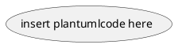

This is a guide to render markdown documents using existing vscode extensions

Dependencies:
* Pandoc
* MarkdownEnhancedPreview
* PlantUml

Steps:
1. Add page breaks
2. Add pandoc snippet
4. Remove 
```shell

5. Update Document Version
6. Run Pandoc command in bash
```bash
pandoc *.md -o SoftwareDocumentation_<release>.pdf --template.eisvogel --pdf-engine=xelatex
```
7. Rename `pdf` to Document Version

#TODO: Improve documentation flow
#TODO: Explore Restructured Texts