# System Rationale
## Description 


## Objectives 


## Significance 


## Scope


## Definition of Terms

### System Terms

### Development Terms

- Common Confusion
  - Create/Delete is actual creation/deletion of object in database
  - Add/Remove is related to linking of object to another object
  - Naming Convention:
    - In view: [Create/Delete/Add/Remove/Detail/Update]View
    - In urls namespace: `namespace`:[create/delete/add/remove/detail/update]
    - In urls path: `identifier`/[new/delete/add/remove/edit]
    - In permissions: can*[create/delete/add/remove/change]*`<model_name>`

| View           | URL Namespace     | URL Path                                           |
| -------------- | ----------------- | -------------------------------------------------- |
| ListView       | list              |                                                    |
| CreateView     | create            | /new                                               |
| DetailView     | detail            | `<identifier>`                                     |
| UpdateView     | update            | `<identifier>`/edit                                |
| DeleteView     | delete            | `<identifier>`/delete                              |
| AddView        | add\_`model`      | `<identifier>`/add/`<identifier>`                  |
| RemoveView     | remove\_`model`   | `<identifier>`/remove/`<identifier>`               |
| `<Action>`View | `action`\_`model` | `<identifier>`/`<action>`/`<identifier>`(optional) |

## Development Conventions

- AjaxViews

```plantuml { .plantuml plantuml-filename=media/ajax_view_convention.png }
@startuml

skinparam monochrome true
skinparam shadowing false
skinparam arrowThickness 0.7
skinparam packageTitleAlignment left
skinparam usecaseBorderThickness 0.4
skinparam rectangleBorderThickness 1
skinparam actorStyle awesome

package app {
    package ajax {
    }
}

@enduml
```



```shell
# In app.urls
app_name = "<app_name>"
url_patterns = [
    # add
    path(
        "",
        <model_name>ListView.as_view(),
        name="list"
    ),
    # create
    path(
        "new/",
        <model_name>ListView.as_view(),
        name="create"
    ),
    # detail
    path(
        "<dtype:arg>/",
        <model_name>DetailView.as_view(),
        "detail"
    ),
    # update
    path(
        "<dtype:arg>/edit/",
        <model_name>UpdateView.as_view(),
        "update"
    ),
    # delete
    path(
        "<dtype:arg>/delete/",
        <model_name>DeleteView.as_view(),
        "delete"
    ),
    # actions
    path(
        "<dtype:arg>/<action>/",
        <model_name><Action>View.as_view(),
        "<action>"
    ),
    # add
    path(
        "<dtype:arg>/add/<dtype:arg_fk>",
        <model_name>Add<model_name_fk>View.as_view(),
        "add_<model_name_fk>"
    ),
    # remove
    path(
        "<dtype:arg>/remove/<dtype:arg_fk>",
        <model_name>Remove<model_name_fk>View.as_view(),
        "remove_<model_name_fk>"
    ),
    # model_fk model actions
    path(
        "<dtype:arg>/<action>/<dtype:arg_fk>",
        <model_name><Action><model_name_fk>View.as_view(),
        "<action>_<model_name_fk>"
    ),
    path(
        "ajax/",
        include(apps.ajax.urls,
        namespace="ajax")
    )
]

# In app.ajax.urls
app_name = "<app_name>_ajax"
url_patterns = [
    # for list Ajax
    path("", <model_name>AjaxListView.as_view(), name="list"),
    # for detail ajax
    path(
        "<dtype:arg>/<model_name_fk>/",
        <model_name><model_name_fk>AjaxListView.as_view(), 
        "<model_name>_list"
    ),
    # for action ajax
    path(
        "<dtype:arg>/<action>/",
        <model_name><Action>AjaxView.as_view(),
        "<action>"
    ),
    path(
        "<dtype:arg>/<action>/<dtype:arg_fk>",
        <model_name><Action><model_name_fk>AjaxView.as_view(),
        "<action>_<model_name_fk>"
    ),
]

```

```html



```