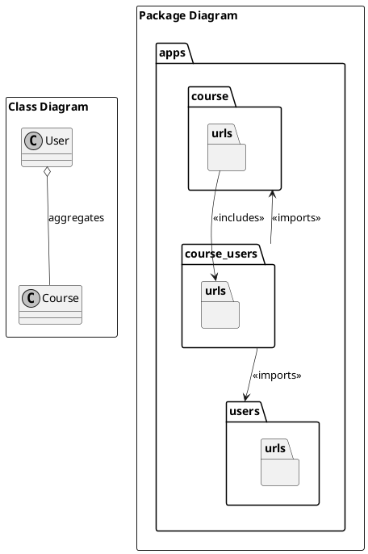
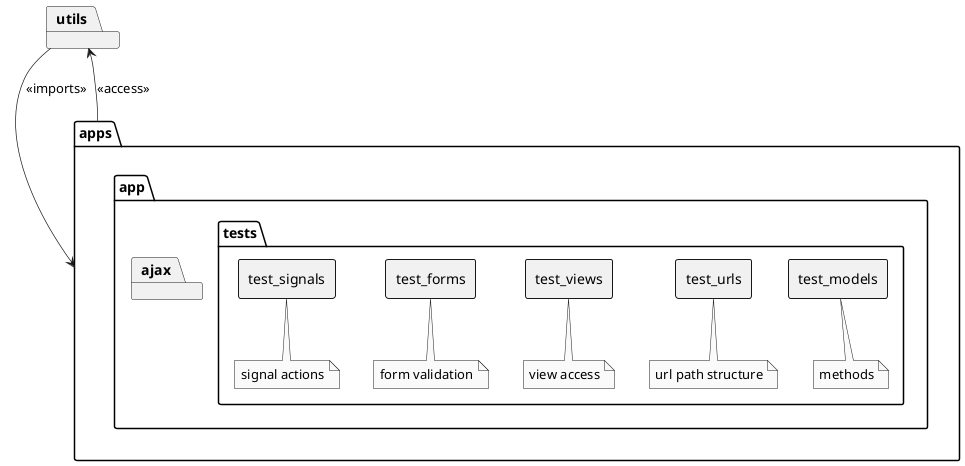
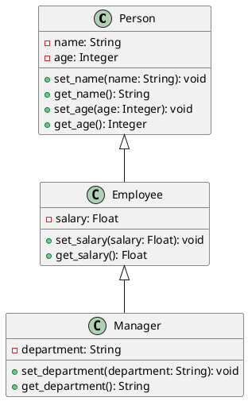
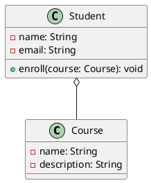

## Coding Conventions

### Common Confusion
  - Create/Delete is actual creation/deletion of object in database
  - Add/Remove is related to linking of object to another object
  - Naming Convention:
    - In view: [Create/Delete/Add/Remove/Detail/Update]View
    - In urls namespace: `namespace`:[create/delete/add/remove/detail/update]
    - In urls path: `identifier`/[new/delete/add/remove/edit]
    - In permissions: can*[create/delete/add/remove/change]*`<model_name>`

### App name creations

<!-- DON'T FORGET TO RENAME FILENAME
AND REMOVE PLANTUML AFTER -->


### Naming Conventions

#### Model Views

| View           | URL Namespace     | URL Path                                           |
| -------------- | ----------------- | -------------------------------------------------- |
| `<model>`ListView       | list              |                                                    |
| `<model>`CreateView     | create            | /new                                               |
| `<model>`DetailView     | detail            | `<identifier>`                                     |
| `<model>`UpdateView     | update            | `<identifier>`/edit                                |
| `<model>`DeleteView     | delete            | `<identifier>`/delete                              |
| `<model>`AddView        | add\_`model`      | `<identifier>`/add/`<model>`/`<identifier>`                  |
| `<model>`RemoveView     | remove\_`model`   | `<identifier>`/remove/`<model>`/`<identifier>`               |
| `<Action>`View | `action` | `<identifier>`/`<action>` |
| *include* | `<model>` | `<model>`|

#### Ajax Views

```plantuml { .plantuml plantuml-filename=media/ajax_view_convention.png }
@startuml

skinparam monochrome true
skinparam shadowing false
skinparam arrowThickness 0.7
skinparam packageTitleAlignment left
skinparam usecaseBorderThickness 0.4
skinparam rectangleBorderThickness 1
skinparam actorStyle awesome

package app {
    package ajax {
    }
}

@enduml
```



| View           | URL Namespace     | URL Path                                           |
| -------------- | ----------------- | -------------------------------------------------- |
| `<model>`ListAjaxView       | list              |                                                    |
| `<model>`CreateAjaxView     | create            | /new                                               |
| `<model>`DetailAjaxView     | detail            | `<identifier>`                                     |
| `<model>`UpdateAjaxView     | update            | `<identifier>`/edit                                |
| `<model>`DeleteAjaxView     | delete            | `<identifier>`/delete                              |
| `<model>`AddAjaxView        | add\_`model`      | `<identifier>`/add/`<model>`/`<identifier>`                  |
| `<model>`RemoveAjaxView     | remove\_`model`   | `<identifier>`/remove/`<model>`/`<identifier>`               |
| `<Action>`View | `action` | `<identifier>`/`<action>` |
| *include* | `<model>` | `<model>`|


```shell
# In app.urls
app_name = "<app_name>"
url_patterns = [
    # add
    path(
        "",
        <model_name>ListView.as_view(),
        name="list"
    ),
    # create
    path(
        "new/",
        <model_name>ListView.as_view(),
        name="create"
    ),
    # detail
    path(
        "<dtype:arg>/",
        <model_name>DetailView.as_view(),
        "detail"
    ),
    # update
    path(
        "<dtype:arg>/edit/",
        <model_name>UpdateView.as_view(),
        "update"
    ),
    # delete
    path(
        "<dtype:arg>/delete/",
        <model_name>DeleteView.as_view(),
        "delete"
    ),
    # actions
    path(
        "<dtype:arg>/<action>/",
        <model_name><Action>View.as_view(),
        "<action>"
    ),
    # add
    path(
        "<dtype:arg>/add/<dtype:arg_fk>",
        <model_name>Add<model_name_fk>View.as_view(),
        "add_<model_name_fk>"
    ),
    # remove
    path(
        "<dtype:arg>/remove/<dtype:arg_fk>",
        <model_name>Remove<model_name_fk>View.as_view(),
        "remove_<model_name_fk>"
    ),
    # model_fk model actions
    path(
        "<dtype:arg>/<action>/<dtype:arg_fk>",
        <model_name><Action><model_name_fk>View.as_view(),
        "<action>_<model_name_fk>"
    ),
    path(
        "ajax/",
        include(apps.ajax.urls,
        namespace="ajax")
    )
]

# In app.ajax.urls
app_name = "<app_name>_ajax"
url_patterns = [
    # add
    path(
        "",
        <model_name>ListAjaxView.as_view(),
        name="list"
    ),
    # create
    path(
        "new/",
        <model_name>ListAjaxView.as_view(),
        name="create"
    ),
    # detail
    path(
        "<dtype:arg>/",
        <model_name>DetailAjaxView.as_view(),
        "detail"
    ),
    # update
    path(
        "<dtype:arg>/edit/",
        <model_name>UpdateAjaxView.as_view(),
        "update"
    ),
    # delete
    path(
        "<dtype:arg>/delete/",
        <model_name>DeleteAjaxView.as_view(),
        "delete"
    ),
    # actions
    path(
        "<dtype:arg>/<action>/",
        <model_name><Action>AjaxView.as_view(),
        "<action>"
    ),
    # add
    path(
        "<dtype:arg>/add/<dtype:arg_fk>",
        <model_name>Add<model_name_fk>AjaxView.as_view(),
        "add_<model_name_fk>"
    ),
    # remove
    path(
        "<dtype:arg>/remove/<dtype:arg_fk>",
        <model_name>Remove<model_name_fk>AjaxView.as_view(),
        "remove_<model_name_fk>"
    ),
    # model_fk model actions
    path(
        "<dtype:arg>/<action>/<dtype:arg_fk>",
        <model_name><Action><model_name_fk>AjaxView.as_view(),
        "<action>_<model_name_fk>"
    ),
]

```

```html



```
### File Navigation



## Work Flow

1. Create Use Case Diagram
2. Create Entity Relationship Diagram
    * Identify methods needed
    * Avoid circular imports. Base it on relationship type
3. Create Sequence Diagram for Access
    * Identify signals or form update
4. Parallel developmenet
    * Code model methods
        * Create Factories for mocking
        * Create test_methods
        * Create test_signals
    * Sitemap
        * Create test_urls
    * Mockup
        * Template Structuring
            * Ensure static files are loaded and in folder
5. Extend models to views and forms
    * create base views and methods
    * create test_views
    * create test_forms
6. UI Testing
    * refer to test plan
7. Test Server Deployment
    * preferably setup in parallel with workflow

## References

### Class Relationships

* Extension - is-a

Indicate that one class inherits from another.



* Composition - part-of

Composition is where the "part" is tightly bound to the "whole", and typically cannot exist without it.

<!-- DON'T FORGET TO RENAME FILENAME
AND REMOVE PLANTUML AFTER -->


```plantuml { .plantuml plantuml-filename=media/plantuml.png }
@startuml

skinparam monochrome true
skinparam shadowing false
skinparam arrowThickness 0.7
skinparam packageTitleAlignment left
skinparam usecaseBorderThickness 0.4
skinparam rectangleBorderThickness 1
skinparam actorStyle awesome

@startuml
class Engine {
  -type: String
  -capacity: Integer
}

class Car {
  -make: String
  -model: String
  -engine: Engine
  +start(): void
  +stop(): void
}

Car *-- Engine
@enduml
```

* Aggregation - contains

Note that aggregation is similar to composition, but it indicates that the two classes have a "loose" relationship, where the "part" (the Course objects) can exist independently of the "whole" (the Student objects)

<!-- DON'T FORGET TO RENAME FILENAME
AND REMOVE PLANTUML AFTER -->
